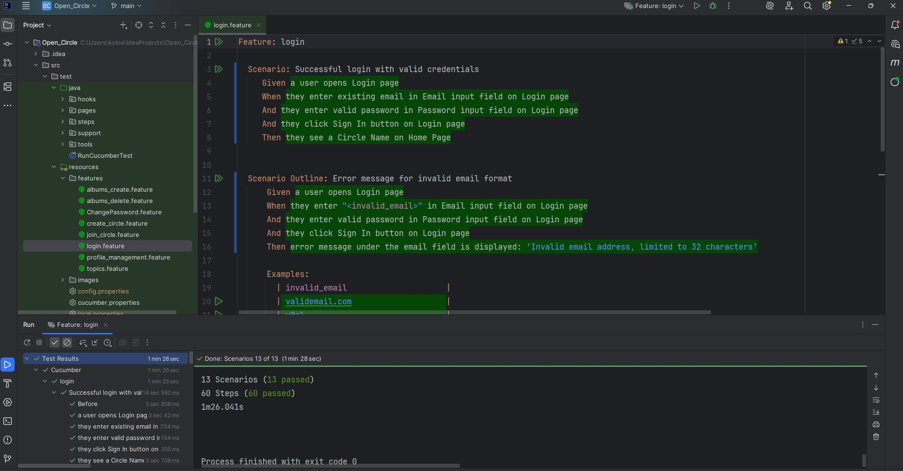

Selenium WebDriver + Java + Cucumber BDD Demo Project

This is a demonstration QA automation project built with:

Java
Selenium WebDriver
Cucumber (BDD)
Maven
Page Object Model (POM)

The project demonstrates automated UI test execution, end-to-end validation flows, and BDD-style test scenarios with readable feature files.

Features:
  Selenium WebDriver UI automation
  Cucumber BDD scenarios
  Page Object Model architecture
  Test execution via Maven
  Cross-browser ready structure
  Automated validations and assertions
  Clear reporting and maintainable framework structure

The screenshot demonstrates successful execution of the automated test suite, where all validations and verifications passed without errors.

